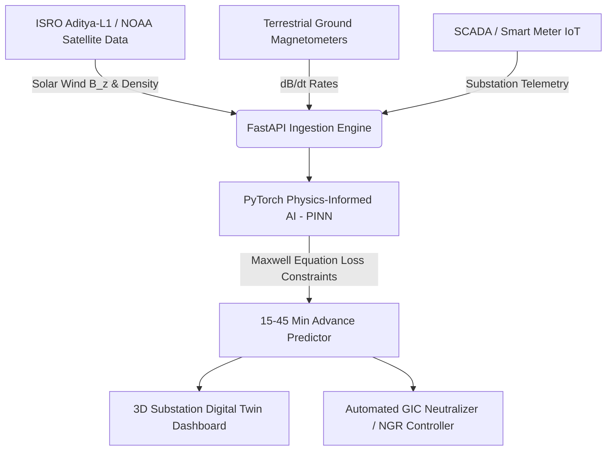

# SuryaDrishti / SuryaGrid: Physics-Informed AI for Solar Flare (GIC) Protection & Smart Grid Reliability ⚡🌞

[](https://yuvayodhatech.com/)
[](https://indiaaiimpactfest.ai-for-all.in/)
[](https://python.org)
[](https://pytorch.org)
[](LICENSE)

---

## 🎥 Video Demo & Pitch

Watch our live project pitch and platform demo on YouTube:

[](https://youtu.be/efOdsq4FuBQ)

📺 **Watch Video Link:** [https://youtu.be/efOdsq4FuBQ](https://youtu.be/efOdsq4FuBQ)

---

## 📌 Executive Summary

**SuryaDrishti** (also known as **SuryaGrid**) is a Physics-Informed Artificial Intelligence (PINN) platform designed for pre-emptive power grid defense, solar flare geomagnetic disturbance (GMD) forecasting, and EHV (Extra-High-Voltage) transformer thermal protection.

By fusing real-time satellite solar wind telemetry from **ISRO's Aditya-L1** and **NOAA satellites** with Maxwell’s electromagnetic equations, SuryaDrishti predicts Geomagnetically Induced Current (GIC) surge magnitudes and transformer core saturation **15 to 45 minutes ahead** of critical grid failure.

---

## 🎯 Hackathon Categories & Alignment

1. **Schneider Electric Yuva Yodha Energy Tech Hackathon 2026**
   * **Challenge Category:** `Grid Reliability`
   * **Key Focus:** EHV Transformer Protection, Substation Asset Performance Management, Microgrid Resilience, & EcoStruxure Platform Integration.

2. **India AI Impact Festival 2026**
   * **Challenge Category:** AI for Energy Infrastructure & Space Telemetry.

---

## ✨ Key System Features

* 🛰️ **Space Telemetry Ingestion:** Real-time ingestion of solar wind density, velocity, magnetic vector ($B_z$), and ground magnetometer rates ($dB/dt$).
* 🧠 **Physics-Informed Neural Network (PINN):** Incorporates Maxwell's Electromagnetic Equations directly into model loss functions, ensuring zero false hallucinations during extreme solar storms.
* 🖥️ **3D Digital Twin Substation Control:** Interactive 3D visualization of substation transformers with real-time risk heatmaps, core saturation metrics, and top-oil thermal warnings.
* ⚡ **Automated Neutralization Logic:** Recommends or executes pre-emptive Neutral Grounding Resistor (NGR) insertion, series capacitor switching, and reactive power compensation.

---

## 🏗️ System Architecture



---

## 📊 Presentation Decks & Documentation

* 📄 **Interactive 16:9 Presentation:** [`schneider_presentation.html`](schneider_presentation.html)
* 📘 **Comprehensive Tech & Pitch Guide:** [`surya_drishti_pitch_and_tech_guide.md`](surya_drishti_pitch_and_tech_guide.md)
* 🚀 **One-Click Batch Launcher:** `START_SURYADRISHTI.bat`

---

## 👥 Team Members

| Role | Name | Email | Social Links |
| :--- | :--- | :--- | :--- |
| **Team Lead** 👑 | **Lidiya** | `duddekuntalidiya@gmail.com` | - |
| **Team Member** | **Deep Halder** | `deephalder209@gmail.com` | - |
| **Team Member** | **Sayan Pramanik** | `pramaniksayak145@gmail.com` | - |
| **Team Member** | **Rituraj Saha** | `saharituraj805@gmail.com` | [GitHub](https://github.com/RiturajtheCoder) \| [LinkedIn](https://www.linkedin.com/in/rituraj-saha-4072482a9/) |

---

## 🚀 Quick Start & Installation

```bash
# Clone the repository
git clone https://github.com/deepshekhar555/BAH2026-PS15-SuryaDrishti.git
cd BAH2026-PS15-SuryaDrishti

# Set up virtual environment
python -m venv .venv
.venv\Scripts\activate

# Install dependencies
pip install -r requirements.txt

# Run the 3D Control Center Dashboard
python -m dashboard.main
```

---

## 📜 License

Distributed under the MIT License. See `LICENSE` for details.
